# Arquitectura Tecnica

## Objetivo

El sistema analiza conversaciones historicas normalizadas en PostgreSQL para detectar preguntas recurrentes por workspace, sugerir FAQs nuevas o mejoras y permitir validacion humana antes de convertirlas en FAQs persistentes. El objetivo es generar candidatos revisables, no autopublicar contenido perfecto sin supervision.

## Modelo de datos

La fuente operativa del backend es `faq_mvp`, no las tablas crudas antiguas.

- `workspaces`, `agents`, `conversations`, `messages`: base conversacional normalizada.
- `existing_faqs`: FAQs heredadas desde `agent_faqs` y FAQs aprobadas desde el MVP.
- `pipeline_runs`: auditoria de cada ejecucion manual o programada.
- `pipeline_metrics`: metricas numericas de la corrida.
- `question_clusters`: grupos semanticos detectados.
- `faq_candidates`: sugerencias revisables.
- `faq_candidate_examples`: mensajes reales que soportan cada sugerencia.
- `faq_candidate_edit_events`: historial de ediciones humanas de pregunta/respuesta.
- `message_embeddings`: embeddings de mensajes de usuario usados como evidencia.
- `faq_validation_events`: historial de cambios de estado y comentarios humanos.

`company_id` se mantiene como alias de `workspace_id` en las respuestas API para compatibilidad.

## Flujo

```mermaid
flowchart LR
    A["faq_mvp.messages"] --> B["Ingesta: pares usuario/asistente"]
    B --> C["Filtros FAQ y limpieza PII"]
    C --> D["Embeddings locales"]
    D --> E["DBSCAN por workspace"]
    E --> F["Compuerta de soporte, cohesion e intencion"]
    F --> G["Qwen JSON: cluster_intent + knowledge + FAQ"]
    G --> Q["Alineacion pregunta-cluster + repair"]
    Q --> K["Validadores y tier de calidad"]
    K --> L["Deduplicacion contra FAQs y candidatos previos"]
    L --> M["faq_candidates + examples + clusters"]
    M --> N["Edicion humana opcional"]
    N --> O["faq_candidate_edit_events"]
    N --> H["Validacion humana"]
    H --> I["faq_validation_events"]
    H --> J["Promocion approved a existing_faqs"]
```



## Servicios

### Ingesta

`ingest_service.py` consulta `faq_mvp.messages` unido con `conversations` y `workspaces`. Solo procesa `role IN ('user', 'assistant')` con `content_text` no vacio. `since_days` se aplica sobre el timestamp del mensaje elegible. Cuando hay `limit`, el limite se aplica sobre conversaciones completas ordenadas por actividad reciente de conversacion, no sobre mensajes sueltos; despues se recuperan todos los mensajes de esas conversaciones para no cortar pares usuario/asistente.

En corridas manuales por empresa, `limit` puede omitirse. En ese caso el backend usa `complete_if_fits`: si el rango solicitado tiene hasta `FAQ_SAFE_FULL_ANALYSIS_LIMIT` mensajes elegibles (default `50000`), procesa todo; si lo supera, trunca por conversaciones completas y devuelve las metricas de truncamiento para que el frontend avise al usuario.

En cada conversacion empareja el ultimo mensaje del usuario con la siguiente respuesta del asistente y conserva:

- `workspace_id` / `company_id`;
- `company_name`;
- `agent_id`;
- `conversation_pk`;
- `conversation_id`;
- `user_message_pk`;
- `assistant_message_pk`;
- textos y timestamps.

La ingesta devuelve metricas de muestreo y truncamiento:

- `raw_messages_found` / `raw_messages_processed`;
- `conversations_found` / `conversations_processed`;
- `truncation_applied` / `truncation_ratio`;
- `limit` / `effective_limit` / `analysis_limit_mode`;
- `user_messages_considered` / `assistant_messages_considered`;
- `user_assistant_pairs_built`;
- `pairs_rejected_no_assistant_followup`;
- `pairs_rejected_empty_text`.

Esta decision corrige el bug real de `workspace_id=126`: con 90 dias no habia truncamiento (7.966 mensajes), pero con 365 dias habia 20.980 mensajes y el antiguo `LIMIT 15000` sobre mensajes sueltos dejaba fuera conversaciones recientes completas. Con `complete_if_fits`, una corrida manual por empresa no trunca este rango porque queda bajo el maximo seguro configurable; si se envia un limite explicito, se conserva por compatibilidad.

### Sugerencias

`suggestion_service.py` crea una fila `running` en `pipeline_runs`, procesa mensajes recientes y finaliza la corrida como `succeeded` o `failed`.

El pipeline:

1. Filtra saludos, respuestas triviales, correos, telefonos y preguntas operativas no FAQ.
2. Genera embeddings locales con `sentence-transformers/paraphrase-multilingual-MiniLM-L12-v2` o fallback hash.
3. Agrupa por workspace con DBSCAN.
4. Calcula soporte del cluster y silhouette score si hay suficientes clusters.
5. Rechaza basura real y deja pasar clusters medianos como candidatos `needs_review` cuando la intencion es clara.
6. Genera con Qwen un JSON estructurado con `publish`, `cluster_intent_statement`, `knowledge_statement`, `canonical_question`, `canonical_answer`, `confidence` y `reason`.
7. Valida que la pregunta FAQ este anclada a las preguntas del cluster, no a datos colaterales de respuestas historicas.
8. Valida `knowledge_statement`, pregunta, respuesta, alineacion pregunta/respuesta y soporte en evidencia gradual.
9. Deduplica contra `faq_mvp.existing_faqs` y contra candidatos previos usando la pregunta canonica, no el mensaje raw.
10. Persiste clusters, candidatos, ejemplos, embeddings y metricas.

La pregunta final guardada en `faq_candidates.normalized_question` es la mejor pregunta para la intencion recurrente del cluster, no una reformulacion literal del mensaje de usuario ni una pregunta construida desde respuestas del asistente. La respuesta final guardada en `suggested_answer` puede aprovechar respuestas historicas, pero debe pasar validadores contra saludos, nombres, emojis, placeholders, preguntas de seguimiento, referencias temporales, trazas internas, contradicciones con evidencia y terminos concretos no soportados. Ambas se disenan para ser cortas, claras y revisables.

### Intencion del cluster vs conocimiento de respuesta

El contrato interno del LLM separa dos capas:

- `cluster_intent_statement`: describe lo que los usuarios preguntan repetidamente. Su fuente primaria son las preguntas limpias del cluster.
- `knowledge_statement`: describe el conocimiento que puede responder esa intencion. Puede usar respuestas historicas del asistente, siempre que no cambie el tema de la pregunta.

Esto evita el caso en que un cluster como `Quiero el box mujer`, `Tienen box mujer` termina generando `¿La entrega es en la zona urbana de Fusagasuga?` solo porque una respuesta historica menciono entrega. En ese caso la pregunta canonica esta desalineada y se rechaza o se repara hacia el tema real del cluster.

`is_canonical_question_aligned_with_cluster(...)` devuelve:

- `strong_alignment`: la pregunta comparte categoria, terminos o similitud semantica suficiente con el centroide del cluster.
- `partial_alignment`: la pregunta es aprovechable, pero queda en `needs_review`.
- `misaligned`: la pregunta introduce otro tema; se intenta repair y, si falla, se hard reject.

La validacion combina embeddings, similitud promedio, categorias de intencion y solapamiento de terminos. Si la pregunta introduce una categoria primaria nueva, por ejemplo `shipping` en un cluster de productos, no se recupera como FAQ aunque el dato aparezca en respuestas historicas.

El repair pass recibe preguntas reales, `cluster_intent_statement`, `knowledge_statement`, pregunta/respuesta originales y razon de desalineacion. El objetivo es reformular hacia la intencion recurrente sin inventar soporte. Si la pregunta queda alineada pero la respuesta solo tiene evidencia parcial, se persiste como `question_with_answer_review`.

Los ejemplos de soporte se guardan para auditoria y se deduplican antes del API/frontend. La seleccion prioriza textos distintos, representativos y alineados con la pregunta final. Si solo hay una formulacion repetida, se muestra una vez y `cluster_size` conserva la frecuencia total.

El pipeline usa niveles orientados a revision humana:

- `hard_reject`: no se persiste; aplica para tool traces, clusters mezclados, falta total de evidencia, JSON imposible de recuperar o pregunta/respuesta ininteligible.
- `high_confidence`: se persiste como candidato pendiente con intencion clara, buena cohesion y respuesta solida.
- `needs_review`: se persiste con `status=needs_review`, `candidate_metadata.quality_tier = "needs_review"` y `review_reason`; aplica para confianza media, cohesion media, evidencia parcial, respuesta prudente o repair automatico.
- `question_with_answer_review`: subtipo de candidato (`candidate_metadata.candidate_kind`) cuando la pregunta es fuerte pero la respuesta necesita edicion humana.

Antes de descartar por pregunta canonica invalida, `knowledge_statement` invalido o desalineacion pregunta/respuesta, el pipeline intenta un repair pass con Qwen3-1.7B. El soporte de evidencia devuelve `strong`, `partial`, `weak` o `none`; `partial` y `weak` no son hard reject si la pregunta es clara y la respuesta es prudente.

Recuperacion y clustering:

- `FAQ_CANDIDATE_HARVEST_MODE=strict|broad`; el default recomendado es `broad` para recuperar mas material antes de clusterizar.
- `FAQ_ALLOW_TWO_EXAMPLE_CLUSTERS=true` permite clusters de 2 ejemplos solo como `needs_review` si superan `FAQ_TWO_EXAMPLE_MIN_COHESION`.
- `FAQ_ENABLE_HIERARCHICAL_FALLBACK=true` activa una alternativa jerarquica local cuando DBSCAN deja todo como ruido en grupos pequenos.

Deduplicacion y supresion:

- `duplicates_against_existing_faqs`: similares a FAQs ya aprobadas.
- `duplicates_against_previous_candidates`: similares o exactos frente a candidatos anteriores.
- `candidates_skipped_existing`: omitidos por `FAQ_SKIP_EXISTING=true`.
- `candidates_superseded`: candidatos exactos actualizados/reemplazados en vez de duplicarse.

Cuando un candidato exacto actualiza uno previo, `candidate_metadata.deduplication_status` queda como `superseded_previous_candidate`. Cuando es similar a un candidato previo, se persiste en el run actual como `similar_to_previous_candidate` para que no desaparezca de `GET /suggestions` latest. Los descartes que no se persisten quedan visibles en metricas, logs y `scripts/debug_workspace_pipeline.py`.

### Validacion

`validation_service.py` trabaja contra la base:

- `GET /suggestions`: lista candidatos con filtros por `status`, `workspace_id` y `agent_id`.
- `GET /validations`: lista eventos humanos.
- `PATCH /suggestions/{candidate_id}`: edita pregunta/respuesta de un candidato y crea evento en `faq_candidate_edit_events`.
- `POST /validate`: actualiza estado del candidato e inserta evento.
- `GET /workspaces`: lista empresas disponibles para que la UI trabaje desde una empresa concreta.

Por defecto `GET /suggestions` restringe la salida a candidatos asociados a la ultima corrida `succeeded` en `pipeline_runs`. Cuando se envia `workspace_id`, la ultima corrida se resuelve con preferencia por ese workspace para evitar mezclar empresas. Para revisar historial completo puede usarse `include_all=true`.

Estados validos:

- `approved`
- `rejected`
- `needs_review`

`POST /validate` acepta opcionalmente `edited_question` y `edited_answer`. Si llegan, el backend persiste primero la edicion, crea evento de edicion, actualiza `faq_candidates.normalized_question` y `faq_candidates.suggested_answer`, y luego aplica la validacion. Al aprobar, el servicio promueve la version editada a `faq_mvp.existing_faqs` usando `candidate_id` como `faq_id`. Esta decision evita crear una segunda tabla de FAQs activas y hace que futuras corridas dedupliquen automaticamente contra lo aprobado. La promocion falla con error claro si falta `agent_id` o `suggested_answer`.

`GET /suggestions` expone campos de revision: `was_human_edited`, `last_edited_by`, `last_edited_at`, `edit_count`, `knowledge_statement`, `quality_tier`, `review_reason`, `generation_confidence`, `since_days_used` y `workspace_id`.

### Scheduler

`scheduler.py` ejecuta `run_suggestion_pipeline()` semanalmente por defecto:

```env
FAQ_SCHEDULE_INTERVAL_DAYS=7
```

El job usa el mismo flujo persistente que `POST /suggest`, por lo que siempre deja `pipeline_runs` y `pipeline_metrics`.

### Frontend

`frontend/` es una app React/Vite conectada a:

- `POST /ingest`
- `POST /suggest`
- `GET /suggestions`
- `GET /workspaces`
- `POST /validate`
- `PATCH /suggestions/{candidate_id}`
- `GET /validations`

CORS se configura con `CORS_ALLOW_ORIGINS`, incluyendo `http://localhost:5173` para desarrollo.

La cabecera del frontend contiene los controles principales:

- selector de empresa (`workspace_id`);
- rango dinamico `since_days` para analizar chats de los ultimos 7, 30, 60, 90, 180 o 365 dias;
- boton para generar sugerencias solo para la empresa seleccionada.

## Modelos locales

Embeddings:

- Por defecto: `sentence-transformers/paraphrase-multilingual-MiniLM-L12-v2`.
- Alternativa ligera: `all-MiniLM-L6-v2`.
- Alternativa: `FAQ_EMBEDDING_BACKEND=hash`, sin descargas ni dependencias semanticas.

El modelo multilingue se recomienda porque las conversaciones reales estan mayoritariamente en espanol; mejora la similitud semantica entre preguntas equivalentes y reduce clusters mezclados. La variable `FAQ_EMBEDDING_MODEL` sigue siendo configurable. Los embeddings se persisten con unicidad por `(message_pk, embedding_model)`, por lo que un cambio de dimensiones o de modelo no reutiliza vectores incompatibles.

Generacion:

- Recomendado: `Qwen/Qwen3-1.7B`.
- Ultraligero: `Qwen/Qwen2.5-0.5B-Instruct`.
- Alternativa intermedia: `Qwen/Qwen2.5-1.5B-Instruct`.
- Qwen actua como normalizador de conocimiento empresarial, no como chatbot.
- La salida obligatoria es JSON valido con `publish`, `knowledge_statement`, `canonical_question`, `canonical_answer`, `confidence` y `reason`.
- Para Qwen3 se intenta `enable_thinking=False` en `apply_chat_template`; cualquier bloque `<think>...</think>` se elimina antes del parseo.
- `publish=false` debe usarse solo cuando no hay patron recurrente claro, el cluster mezcla intenciones o no existe forma prudente de responder sin inventar.
- Si Qwen no carga, falla, devuelve JSON invalido, `publish=false` o una salida que no pasa validadores, no se publica candidato.
- Ya no existe fallback que publique respuestas historicas crudas.

No se consumen APIs externas pagas.

Benchmark real de referencia para `workspace_id=126`, 90 dias:

- `Qwen/Qwen2.5-0.5B-Instruct`: 15 JSON validos, 0 aceptados por validadores; tendencia a copiar preguntas como `knowledge_statement` o generar respuestas tipo WhatsApp.
- `Qwen/Qwen3-1.7B`: 15 JSON validos, 6 aceptables en benchmark, sin `<think>`; mejora clara de alineacion pregunta/respuesta, aunque es mas lento.

## Persistencia e idempotencia

- Cada corrida crea `pipeline_runs`.
- Los embeddings usan unicidad por `(message_pk, embedding_model)`.
- Los candidatos se buscan por workspace, agente y pregunta normalizada para evitar duplicados por corridas repetidas.
- Las sugerencias aprobadas se vuelven FAQs activas en `existing_faqs`, cerrando el ciclo de deduplicacion.
- `candidate_metadata` guarda `quality_tier`, `review_reason`, confianza de generacion, razon del LLM, cohesion del cluster, evidencia valida, modo de generacion, `since_days` cuando aplica y modelo de embeddings usado.
- `candidate_metadata` tambien guarda `knowledge_statement`, estado de deduplicacion, si la confianza fue reparada, y si el cluster fue de 2 ejemplos.
- `pipeline_metrics` registra causas de rechazo separadas: truncamiento, pares, candidatos iniciales, embeddings, clusters antes de filtros, bajo soporte, baja cohesion, intencion mezclada, evidencia insuficiente, `publish=false`, baja confianza, pregunta/respuesta invalida, falta de soporte, deduplicacion y candidatos aceptados por tier.
- Las metricas de grounding agregan `cluster_question_alignment_strong`, `cluster_question_alignment_partial`, `cluster_question_alignment_failed`, `repair_alignment_attempts`, `repair_alignment_successes`, `support_examples_deduplicated`, `candidates_rejected_due_to_cluster_misalignment` y `candidates_recovered_after_alignment_repair`.

## Herramientas de debugging

```bash
python scripts/debug_workspace_pipeline.py --workspace-id 126 --since-days 90
python scripts/debug_workspace_pipeline.py --workspace-id 126 --since-days 365
python scripts/benchmark_faq_llms.py --workspace-id 126 --since-days 90
```

El debug exporta mensajes, pares, candidatos iniciales, clusters, evidencia, prompt real, JSON crudo del LLM, salida parseada y razon exacta de rechazo/aceptacion. El benchmark compara modelos sobre los mismos clusters y reporta JSON valido, alineacion, presencia de thinking text, longitudes y tiempo.

Para validar PostgreSQL de verdad:

```powershell
$env:FAQ_EMBEDDING_BACKEND='sentence-transformers'
$env:FAQ_LLM_ENABLED='true'
$env:FAQ_LLM_MODEL='Qwen/Qwen3-1.7B'
.\venv\Scripts\python -c "from faq_models import IngestRequest; from suggestion_service import run_suggestion_pipeline; s=run_suggestion_pipeline(IngestRequest(since_days=365, workspace_id=126)); print(s.model_dump_json(indent=2))"
```

Si una corrida devuelve pocas o cero FAQs, revisar en este orden: truncamiento, candidatos mantenidos para embeddings, clusters antes de compuertas, rechazos por soporte/cohesion/intencion, `llm_publish_false`, validadores, y deduplicacion contra FAQs/candidatos previos.

## Riesgos y mejoras futuras

- Resolver conversaciones sin `agent_id` con reglas de negocio mas fuertes.
- Evaluar HDBSCAN o clustering jerarquico si DBSCAN queda muy sensible.
- Agregar `pgvector` cuando el ambiente lo permita.
- Crear evaluacion experimental con muestra etiquetada por humanos.
- Unificar servicios FastAPI en un gateway si se despliega a produccion.
