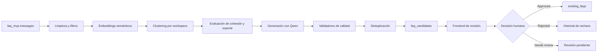

# 🧠 Everwod FAQ Intelligence

> Microservicio inteligente para detectar preguntas recurrentes en conversaciones históricas de WhatsApp, generar sugerencias automáticas de FAQs y permitir validación humana antes de publicarlas.


---

## 📌 Resumen

**Everwod FAQ Intelligence** es un prototipo funcional construido para analizar conversaciones históricas de clientes de Everwod, detectar patrones recurrentes y convertirlos en **preguntas frecuentes sugeridas** para los agentes de IA de cada negocio.

El sistema no publica respuestas automáticamente: genera candidatos, calcula métricas de calidad, conserva evidencia del cluster y permite que una persona revise, edite, apruebe o rechace cada sugerencia.

En otras palabras:

```text
Chats históricos → limpieza → embeddings → clustering → generación FAQ → validación humana → FAQ aprobada
```

---

## ✨ Funcionalidades principales

| Funcionalidad               | Descripción                                                                        |
| --------------------------- | ---------------------------------------------------------------------------------- |
| 🧾 Procesamiento histórico  | Analiza conversaciones almacenadas en PostgreSQL por empresa/workspace.            |
| 🧹 Limpieza y normalización | Filtra ruido, saludos, datos sensibles, trazas internas y textos poco útiles.      |
| 🧬 Embeddings semánticos    | Convierte preguntas en vectores para comparar intención, no solo palabras exactas. |
| 🧩 Clustering               | Agrupa preguntas recurrentes por similitud semántica dentro de cada empresa.       |
| 🤖 Generación con LLM local | Usa Qwen para proponer pregunta canónica y respuesta corta/revisable.              |
| 🧪 Validadores de calidad   | Evalúa alineación, evidencia, cohesión, soporte, confianza y duplicidad.           |
| 👤 Human-in-the-loop        | Permite editar, aprobar, rechazar o marcar como `needs_review`.                    |
| 🔁 Deduplicación            | Evita repetir FAQs ya aprobadas, rechazadas o previamente sugeridas.               |
| ⏱️ Job programado           | Permite ejecución periódica mensual/semanal del pipeline.                          |
| 🚀 Railway-ready            | API unificada lista para despliegue como microservicio.                            |

---

## 🖼️ Vista general del sistema

El frontend permite seleccionar una empresa, definir el rango de antigüedad de los chats y generar nuevas sugerencias.

```text
┌──────────────────────────────┐
│ Frontend React/Vite          │
│ - Selección de empresa       │
│ - Rango de días              │
│ - Validación humana          │
└──────────────┬───────────────┘
               │
               ▼
┌──────────────────────────────┐
│ FastAPI app.api.main         │
│ API unificada                │
└──────────────┬───────────────┘
               │
               ▼
┌──────────────────────────────┐
│ Pipeline FAQ                 │
│ limpieza + embeddings        │
│ clustering + Qwen + quality  │
└──────────────┬───────────────┘
               │
               ▼
┌──────────────────────────────┐
│ PostgreSQL                   │
│ everwod_raw + faq_mvp        │
└──────────────────────────────┘
```

---

## 🏗️ Arquitectura del proyecto

```text
Everwod_IA_FAQs-main/
├── app/
│   ├── api/          # API FastAPI, routers y API unificada
│   ├── core/         # Configuración, modelos Pydantic y helpers comunes
│   ├── ingestion/    # Adaptador everwod_raw y escritura normalizada a faq_mvp
│   ├── jobs/         # Scheduler y ejecución periódica
│   ├── pipeline/     # Limpieza, filtros, embeddings, clustering, LLM y calidad
│   └── repository/   # Persistencia SQL, métricas, candidatos y validaciones
├── frontend/         # Panel React/Vite para revisión humana
├── scripts/          # Scripts de ejecución, debug y benchmark
├── tests/            # Pruebas automatizadas
├── docs/             # Documentación técnica
├── Dockerfile
├── docker-compose.yml
├── requirements.txt
├── requirements-no-torch.txt
└── README.md
```

La lógica de negocio vive dentro de `app/`. Los archivos raíz `suggestion_service.py`, `ingest_service.py`, `validation_service.py` y `scheduler.py` se conservan como entrypoints legacy para compatibilidad, pero el despliegue recomendado usa `app.api.main`.

---

## 🧠 Flujo técnico del pipeline



### Etapas principales

1. **Carga de conversaciones** desde `faq_mvp.messages`.
2. **Limpieza textual** para reducir ruido y evitar datos sensibles.
3. **Embeddings semánticos** usando modelos locales configurables.
4. **Clustering** para detectar preguntas frecuentes por intención.
5. **Generación LLM** para crear pregunta canónica y respuesta prudente.
6. **Quality gates** para validar evidencia, alineación y utilidad.
7. **Deduplicación** contra FAQs existentes y candidatos anteriores.
8. **Validación humana** antes de aprobar cualquier FAQ.

---

## 🗄️ Modelo de datos

El sistema trabaja con dos schemas principales en PostgreSQL:

| Schema        | Propósito                                               |
| ------------- | ------------------------------------------------------- |
| `everwod_raw` | Copia cruda del dump entregado por Everwod.             |
| `faq_mvp`     | Modelo limpio e interno usado por el microservicio FAQ. |

Tablas centrales de `faq_mvp`:

| Tabla                    | Uso                                                    |
| ------------------------ | ------------------------------------------------------ |
| `workspaces`             | Empresas/clientes disponibles.                         |
| `agents`                 | Agentes asociados a cada workspace.                    |
| `conversations`          | Conversaciones normalizadas.                           |
| `messages`               | Mensajes usuario/asistente extraídos.                  |
| `existing_faqs`          | FAQs heredadas y FAQs aprobadas por validación humana. |
| `pipeline_runs`          | Auditoría de corridas del pipeline.                    |
| `pipeline_metrics`       | Métricas por ejecución.                                |
| `question_clusters`      | Clusters semánticos detectados.                        |
| `faq_candidates`         | Sugerencias generadas por el sistema.                  |
| `faq_candidate_examples` | Evidencia real que soporta cada sugerencia.            |
| `faq_validation_events`  | Historial de decisiones humanas.                       |

Más detalle: [`docs/data_dictionary.md`](docs/data_dictionary.md).

---

## 🧪 Métricas y calidad

El sistema registra métricas para evaluar cada corrida:

| Métrica                     | Significado                                                   |
| --------------------------- | ------------------------------------------------------------- |
| `cluster_count`             | Cantidad de clusters/sugerencias resultantes.                 |
| `total_examples`            | Cantidad de ejemplos usados como evidencia.                   |
| `silhouette_score`          | Calidad del agrupamiento semántico.                           |
| `hard_rejected`             | Candidatos descartados por baja calidad o falta de evidencia. |
| `persisted_high_confidence` | Candidatos de alta confianza persistidos.                     |
| `persisted_needs_review`    | Candidatos útiles pero que requieren revisión.                |
| `repair_alignment_attempts` | Intentos de reparación con LLM cuando hubo desalineación.     |
| `duplicates_omitted`        | Candidatos omitidos por duplicidad.                           |

### ¿Qué es el silhouette?

El **silhouette score** mide qué tan coherentes y separados están los clusters. Un valor más alto indica que las preguntas agrupadas son más similares entre sí y más distintas de otros grupos.

En el frontend se muestra como **Silhouette pipeline**, porque representa la calidad del agrupamiento generado por la corrida, no necesariamente el número final de sugerencias visibles después de filtros y validación.

Más detalle: [`docs/QUALITY_ISO25010.md`](docs/QUALITY_ISO25010.md).

---

## 👤 Validación humana

El sistema está diseñado bajo un enfoque **human-in-the-loop**:

* La IA propone.
* El humano revisa.
* El humano puede editar.
* El humano aprueba o rechaza.
* El sistema conserva historial.

Estados soportados:

| Estado         | Descripción                                            |
| -------------- | ------------------------------------------------------ |
| `pending`      | Candidato generado y pendiente de revisión.            |
| `needs_review` | Candidato útil, pero requiere revisión especial.       |
| `approved`     | FAQ aprobada y promovida a `existing_faqs`.            |
| `rejected`     | FAQ rechazada y registrada para no volver a sugerirse. |

Cuando una FAQ se aprueba, se promueve a `faq_mvp.existing_faqs`. Cuando se rechaza, queda registrada para evitar duplicidad en futuras corridas.

---

## 🔁 Deduplicación

Antes de persistir o mostrar nuevos candidatos, el sistema compara contra:

* FAQs existentes aprobadas.
* Candidatos previos pendientes.
* Candidatos en revisión.
* Candidatos rechazados, si `FAQ_SKIP_REJECTED=true`.

Esto evita que preguntas ya revisadas vuelvan a aparecer como si fueran nuevas.

Variables relevantes:

```env
FAQ_SKIP_EXISTING=true
FAQ_SKIP_REJECTED=true
FAQ_DUPLICATE_THRESHOLD=0.82
```

---

## ⚙️ Configuración rápida

### 1. Backend

```powershell
python -m venv venv
.\venv\Scripts\Activate.ps1
pip install -r requirements.txt
```

Copia el archivo de entorno:

```powershell
Copy-Item .env.example .env
```

Variables base:

```env
DB_NAME=everwod_faq_mvp
DB_USER=postgres
DB_PASSWORD=postgres
DB_HOST=localhost
DB_PORT=5432
FAQ_SCHEMA=faq_mvp
FAQ_RAW_SCHEMA=everwod_raw
FAQ_LLM_ENABLED=true
FAQ_LLM_MODEL=Qwen/Qwen3-1.7B
FAQ_LLM_DEVICE=cpu
```

### 2. API unificada

```powershell
uvicorn app.api.main:app --reload --port 8003
```

Endpoints principales:

| Endpoint                            | Uso                                   |
| ----------------------------------- | ------------------------------------- |
| `GET /health`                       | Estado del servicio.                  |
| `GET /workspaces`                   | Lista empresas disponibles.           |
| `POST /suggest`                     | Genera sugerencias nuevas.            |
| `GET /suggestions`                  | Lista sugerencias.                    |
| `PATCH /suggestions/{candidate_id}` | Edita pregunta/respuesta.             |
| `POST /validate`                    | Aprueba, rechaza o marca revisión.    |
| `GET /validations`                  | Historial de validaciones.            |
| `POST /ingest`                      | Ingesta segura desde raw hacia clean. |

### 3. Frontend

```powershell
cd frontend
npm install
npm run dev
```

Configuración recomendada para API unificada:

```env
VITE_API_URL=http://127.0.0.1:8003
VITE_INGEST_API_URL=http://127.0.0.1:8003
VITE_SUGGESTION_API_URL=http://127.0.0.1:8003
VITE_VALIDATION_API_URL=http://127.0.0.1:8003
VITE_USE_MOCKS=false
```

Abrir:

```text
http://localhost:5173
```

Guía específica del frontend: [`frontend/README.md`](frontend/README.md).

---

## 🚀 Ejecución de desarrollo

Terminal 1 — Backend:

```powershell
.\venv\Scripts\Activate.ps1
uvicorn app.api.main:app --reload --port 8003
```

Terminal 2 — Frontend:

```powershell
cd frontend
npm run dev
```

Terminal 3 — pruebas:

```powershell
.\venv\Scripts\python -m pytest -p no:cacheprovider
```

Frontend lint/build:

```powershell
cd frontend
npm run lint
npm run build
```

---

## 🔐 Ingesta segura

`POST /ingest` es seguro por defecto. Si no se envía `dry_run`, el backend asume:

```json
{
  "dry_run": true
}
```

Eso permite revisar métricas sin escribir datos.

Ejemplo:

```powershell
Invoke-RestMethod `
  -Uri "http://127.0.0.1:8003/ingest" `
  -Method POST `
  -ContentType "application/json" `
  -Body '{"dry_run":true,"source":"everwod_raw","since_days":365,"limit":5}'
```

La escritura real solo ocurre si se envía explícitamente:

```json
{
  "dry_run": false,
  "source": "everwod_raw"
}
```

La ingesta:

* lee desde `everwod_raw`;
* escribe idempotentemente hacia `faq_mvp`;
* no usa `public`;
* no usa `agent_runs` en la ruta principal;
* no elimina candidatos, corridas, validaciones ni FAQs existentes.

---

## ⏱️ Job programado

El sistema incluye un job mensual/semanal para ejecutar el pipeline automáticamente:

```powershell
python scripts/run_monthly_pipeline.py
```

Variable de control:

```env
FAQ_MONTHLY_RUN_INGEST=false
```

Si se activa:

```env
FAQ_MONTHLY_RUN_INGEST=true
```

el job ejecuta ingesta raw → normalizado antes de generar sugerencias. En producción se recomienda activar esto solo después de validar `/ingest` en `dry_run`.

---

## 🐳 Docker

Construcción:

```bash
docker build -t everwod-faq-api .
```

Ejecución:

```bash
docker run -p 8003:8003 --env-file .env everwod-faq-api
```

Comando por defecto:

```bash
uvicorn app.api.main:app --host 0.0.0.0 --port ${PORT:-8003}
```

La imagen está pensada para CPU por defecto y no requiere CUDA/NVIDIA.

---

## ☁️ Railway

Despliegue recomendado:

| Servicio          | Descripción                              |
| ----------------- | ---------------------------------------- |
| `faq-api`         | Servicio FastAPI permanente.             |
| `faq-monthly-job` | Job programado para ejecución periódica. |
| PostgreSQL        | Base con `everwod_raw` y `faq_mvp`.      |

Comando API:

```bash
uvicorn app.api.main:app --host 0.0.0.0 --port $PORT
```

Comando job:

```bash
python scripts/run_monthly_pipeline.py
```

Cron sugerido:

```cron
0 3 1 * *
```

Más detalle: [`docs/DEPLOYMENT_RAILWAY.md`](docs/DEPLOYMENT_RAILWAY.md).

---

## ✅ Validación del proyecto

Backend:

```powershell
.\venv\Scripts\python -m pytest -p no:cacheprovider
```

Frontend:

```powershell
cd frontend
npm run lint
npm run build
```

Smoke test API:

```powershell
Invoke-RestMethod http://127.0.0.1:8003/health
Invoke-RestMethod http://127.0.0.1:8003/workspaces
Invoke-RestMethod http://127.0.0.1:8003/suggestions
Invoke-RestMethod http://127.0.0.1:8003/validations
```

---

## 📚 Documentación

| Documento                                                          | Descripción                                                         |
| ------------------------------------------------------------------ | ------------------------------------------------------------------- |
| [`docs/ARCHITECTURE.md`](docs/ARCHITECTURE.md)                     | Arquitectura técnica completa, pipeline, validación y persistencia. |
| [`frontend/README.md`](frontend/README.md)                         | Guía específica para ejecutar y configurar el panel React/Vite.     |
| [`docs/data_dictionary.md`](docs/data_dictionary.md)               | Diccionario de datos del schema `faq_mvp`.                          |
| [`docs/source_schema_analysis.md`](docs/source_schema_analysis.md) | Análisis del dump crudo de Everwod y tablas fuente.                 |
| [`docs/DEPLOYMENT_RAILWAY.md`](docs/DEPLOYMENT_RAILWAY.md)         | Guía de despliegue en Railway.                                      |
| [`docs/QUALITY_ISO25010.md`](docs/QUALITY_ISO25010.md)             | Decisiones de calidad alineadas con ISO/IEC 25010.                  |

---

## 🧩 Stack técnico

| Capa          | Tecnología                                             |
| ------------- | ------------------------------------------------------ |
| Backend       | Python, FastAPI, Pydantic                              |
| Base de datos | PostgreSQL                                             |
| NLP           | Sentence Transformers, embeddings semánticos           |
| Clustering    | DBSCAN/HDBSCAN/fallback jerárquico según configuración |
| LLM           | Qwen local configurable                                |
| Frontend      | React, Vite, TypeScript                                |
| Testing       | Pytest, TypeScript compiler                            |
| Deploy        | Docker, Railway                                        |

---

## 🧭 Estado actual

El proyecto se encuentra en estado de **prototipo funcional listo para demostración y entrega académica/empresarial inicial**.

Cumple con:

* procesamiento de conversaciones históricas;
* embeddings semánticos;
* clustering de preguntas recurrentes;
* generación automática de FAQs;
* validación humana;
* deduplicación;
* métricas de calidad;
* ejecución periódica;
* API unificada;
* frontend funcional;
* documentación técnica.

Pendiente para producción real:

* confirmar fuente oficial de datos con Everwod;
* definir permisos readonly o réplica;
* validar contrato JSONB productivo;
* establecer política formal de PII;
* ajustar parámetros con datos mensuales reales.

---

## 👥 Equipo

Proyecto desarrollado como prototipo académico para el reto de Everwod Technologies.

---

## 📝 Nota final

Este sistema no busca reemplazar la revisión humana, sino reducir el trabajo repetitivo de análisis conversacional y entregar candidatos de FAQ con evidencia, trazabilidad y métricas para que una persona tome la decisión final.
